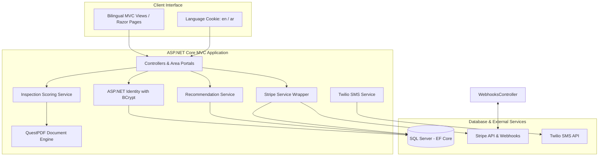
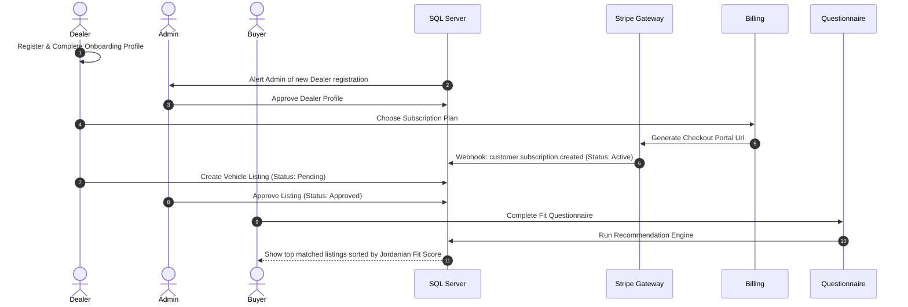

# CarFit Project Website Workflows & Technical Architecture

CarFit is a modern, bilingual (English/Arabic) automotive marketplace and inspection platform built with **ASP.NET Core 10.0 MVC** and **Razor Pages**. It connects buyers, dealers (sellers), and administrators, providing a structured system for listing vehicles, generating auto-scored inspection reports based on the Jordanian chassis scale, recommending cars based on custom profiles, and managing subscriptions via Stripe.

Below is the comprehensive breakdown of the system architecture, role-based user journeys, core engines, and workflows.

---

## 🗺️ High-Level System Architecture

The project is structured around a classic **ASP.NET Core MVC** and **EF Core** pattern, partitioned into **Areas** for role-specific routing and access controls.

---

## 👥 Role-Based Portals & Access Control

CarFit features three primary user roles, each accessing dedicated features and views housed under specific areas:

### 1. 🛡️ Administrator Portal (`/Areas/Admin`)
* **Dashboard:** Monitor site-wide metrics (total listings, active dealers, revenue, inspections).
* **Dealers Management:** Approve or decline onboarded dealerships.
* **Subscription Management:** Seed and maintain subscription tiers.
* **Makes/Models Glossary:** Seed and update lookup tables for vehicle makes and chassis terms.
* **Inspection Bookings:** Review, assign, and update inspection requests from users.
* **Listing Verification:** Approve/reject dealer listings before they go live on the public marketplace.

### 2. 🏢 Seller/Dealer Portal (`/Areas/Seller`)
* **Onboarding Flow:** Registration page requiring business name, phone, email, and location. Profiles must be approved by the admin.
* **Inventory Management:** Create, read, update, and delete vehicle listings. List of options includes custom specs (make, model, engine size, body type, seats, transmission, trim, price, etc.) and primary/secondary images (processed via **SixLabors.ImageSharp**).
* **Subscription Status:** Select monthly/annual plan tiers (Gold, Platinum) via Stripe Checkout.
* **Inspection Submissions:** View inspection reports assigned to their inventory.

### 3. 👤 Buyer Portal (`/Areas/Buyer`)
* **Dashboard:** Access saved cars, comparison lists, and active fit profiles.
* **Fit Profile Questionnaire:** A 5-step wizard capturing the buyer's driving requirements (budget, family size/kids, main purpose, trip types, and transmission/condition preferences).
* **Saved Cars & Compare:** Mark vehicles as favorites and run side-by-side comparisons of car specs and inspection outcomes.
* **Pay-per-Post Trial:** Access a 3-day free trial, followed by a pay-per-post plan for listings (if listing a trade-in vehicle).

---

## ⚙️ Core Technical Workflows

### 1. 🌐 Language Switcher & Localization
CarFit implements sticky bilingual localization (English `en` and Arabic `ar`) using `.resx` files and custom HTTP cookies.

* **Controller:** [LanguageController.cs](file:///c:/Users/user/CarFit/CarFitProject/CarFitProject/Controllers/LanguageController.cs)
* **Mechanism:**
  1. User selects language in the header.
  2. Request hits `/Language/Set?culture=ar&returnUrl=...`.
  3. Appends the culture cookie `CookieRequestCultureProvider.DefaultCookieName` with a 1-year expiration date.
  4. Redirects the client back to the referrer page.
  5. Subsequent requests automatically parse the cookie to localize views and database glossary queries.

---

### 2. 📝 Vehicle Inspection Auto-Scoring Engine
CarFit uses a custom scoring engine based on the official **Jordanian Chassis Scale** to grade used cars and flag potential structural failures.

* **Services:** [InspectionScoringService.cs](file:///c:/Users/user/CarFit/CarFitProject/CarFitProject/Services/InspectionScoringService.cs) and [InspectionReportPdfService.cs](file:///c:/Users/user/CarFit/CarFitProject/CarFitProject/Services/InspectionReportPdfService.cs)
* **Jordanian Chassis Scale Penalties:**
  The engine scores four chassis corners. Each status code carries a negative penalty:
  * `جيد` (Good) or `قصعة شنكل` (Minor towing clip dent) = **0 pts**
  * `دقة على الرأس` (Dent on chassis tip) = **1 pt**
  * `ضربة على الرأس` (Impact on chassis tip) = **2 pts**
  * `ضربة رأسية` (Direct structural impact) = **3 pts**
  * `مضروب` (Damaged chassis) = **5 pts**
  * `مضروب ومشغول` (Damaged and poorly repaired) = **6 pts**
  * `شاصي مقصوص ومغير` (Chassis cut & replaced) = **8 pts**
  * `خالي قص قلبان` (Write-off/rollover/rebuilt) = **10 pts**
* **Overall Score Calculation:**
  $$\text{Total Penalty} = \text{Sum of Chassis Penalties} + \text{Body Surcharge} + \text{Paint Surcharge}$$
  $$\text{Overall Score} = \max(0, 9.99 - (\text{Total Penalty} \times 0.25)) \quad [\text{Cap: 9.99}]$$
  $$\text{Calculated Trust Score} = \max\left(0, \frac{\text{Overall Score}}{2}\right) \quad [\text{Cap: 5.00}]$$
* **Structural Risk Flagging:**
  If any of the chassis corners match `شاصي مقصوص ومغير` or `خالي قص قلبان`, the vehicle is immediately flagged as **Risky** (`IsRisky = true`). This lowers its trust level and places it at the bottom of search/recommendation results regardless of other scores.
* **PDF Generation:**
  Uses **QuestPDF** to render print-ready PDF reports. It dynamically flips the content structure (`page.ContentFromRightToLeft()`) when rendering Arabic and falls back through font family lists (`Cairo` → `Tahoma` → `Arial`) to ensure correct Arabic ligatures and glyph layout.

---

### 3. 🤖 Jordanian Fit & Recommendation Algorithm
The recommendation engine analyzes a buyer's profile (from the 5-step questionnaire) and matches it against approved listings.

* **Service:** [RecommendationService.cs](file:///c:/Users/user/CarFit/CarFitProject/CarFitProject/Services/RecommendationService.cs)
* **Formula:**
  $$\text{Final Score} = (0.50 \times \text{ProfileMatch}) + (0.30 \times \text{InspectionQuality}) + (0.20 \times \text{BudgetFit})$$
* **Component Scoring:**
  1. **ProfileMatch (100 pts max):**
     * *Transmission (20 pts):* Exact match = 20; Unknown = 10; Mismatch = 0.
     * *Size Preference (20 pts):* Direct body-type match = 20; Seat fallback = 10; Unknown = 5.
     * *Family Fit (20 pts):* If $>2$ kids, requires $\ge 7$ seats or SUV/MPV/Van body = 20; otherwise = 0. (No kids constraint defaults to 20).
     * *Purpose (15 pts):* Match body type to utility (e.g., Work $\rightarrow$ Sedan/Hatchback) = 15; Weak match = 7; Mismatch = 0.
     * *Condition (15 pts):* Preference matches listing type (New/Used) = 15.
     * *Trip Type (10 pts):* Engine capacity heuristic (Short trips prefer $\le 1.6\text{L}$; Long trips prefer $\ge 1.8\text{L}$).
  2. **InspectionQuality (100 pts max):**
     * New Car or No Report = 100.
     * Risky flag (`IsRisky == true`) = 5 (hard penalty).
     * Otherwise = $\text{Overall Score} \times 10$.
  3. **BudgetFit (100 pts max):**
     * Within [Min, Max] budget range = 100.
     * Over budget up to 10% or Under minimum budget = 50.
     * Mismatch = 0.
* **Auto-Relaxation (Budget Widening):**
  If zero matches are found in the initial database pull, the algorithm automatically widens the maximum budget limit by **10%** and executes a fallback query. It flags `BudgetRelaxed = true` and generates a notice to notify the user.

---

### 4. 💳 Subscription & Stripe Integration
Dealers and buyers pay for listings or portal services via Stripe.

* **Controller:** [BillingController.cs](file:///c:/Users/user/CarFit/CarFitProject/CarFitProject/Controllers/BillingController.cs)
* **Webhook Sink:** [WebhooksController.cs](file:///c:/Users/user/CarFit/CarFitProject/CarFitProject/Controllers/WebhooksController.cs)
* **Workflows:**
  1. **Checkout Session Creation:**
     * Recurring Subscription (Dealers): Redirects to Stripe Checkout for subscription items.
     * Pay-per-Post (Buyers): Redirects to Stripe Checkout in `payment` mode with metadata linking `appUserId` and `carListingId`.
  2. **Webhook Synchronization (Idempotent):**
     * Handles `checkout.session.completed`, `customer.subscription.created`, `customer.subscription.deleted`, `invoice.paid`, and `invoice.payment_failed`.
     * Writes payment records (`PaymentTransaction`) and subscription state (`SubscriptionStatus`) directly to the database.
     * Handled asynchronously and idempotently (keyed on Stripe Event ID and PaymentIntent ID) to prevent double-charging or missed renewals on retry.
  3. **SMS Alerts:**
     * Integrates with **Twilio** via `ISmsService` to send live notifications to the user's phone on successful renewal, subscription ending, or payment failure.

---

## 📈 Visualizing a Dealership Listing Lifecycle

This diagram displays how a dealer subscription leads to a listing creation, inspection, and public marketplace matching.

